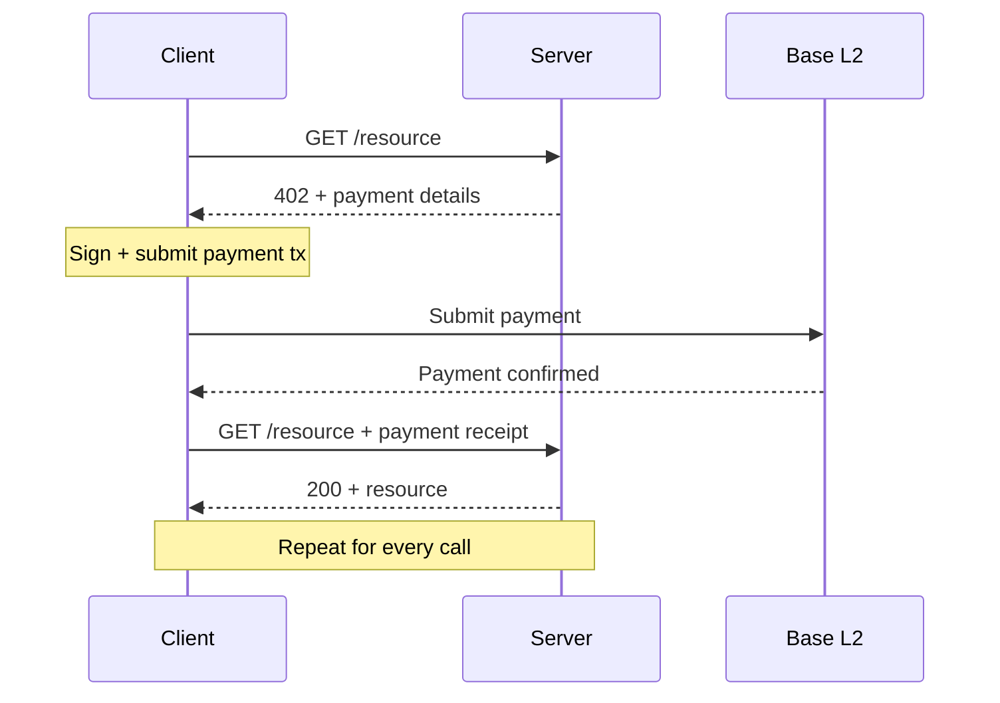
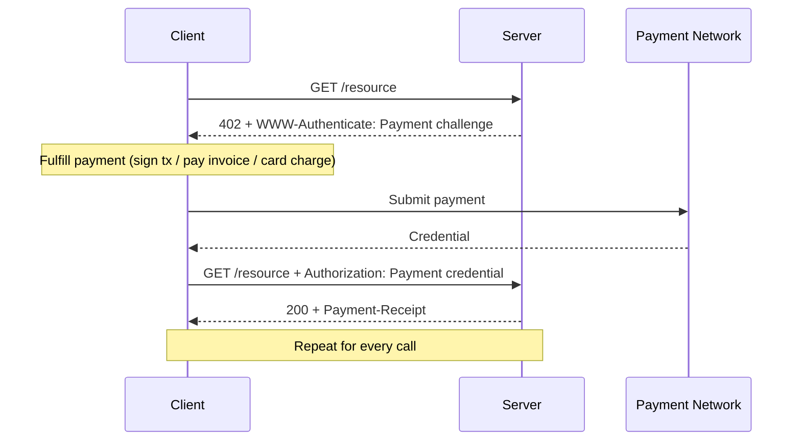
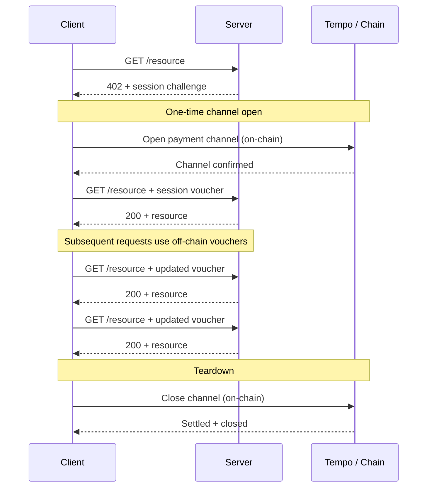
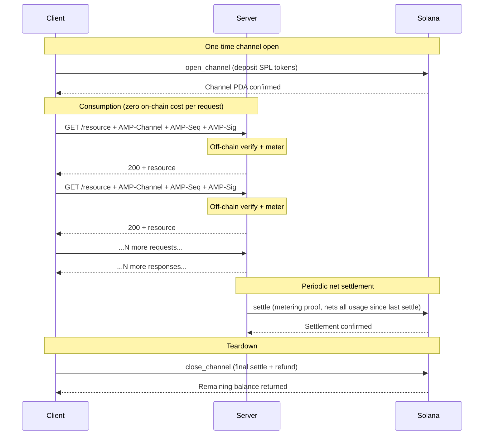

# Protocol Comparison: x402 vs MPP vs AMP

## 1. Protocol Overview

**x402** is Coinbase's machine payment protocol. It uses the HTTP 402 status code to signal payment required. The client pays per-request on Base (EVM) with USDC, then retries with a payment receipt. Simple, stateless, and EVM-native. No sessions, no channels, no streaming. One on-chain transaction per API call.

**MPP** (Machine Payment Protocol) is Tempo and Stripe's extensible HTTP 402 framework. MPP defines multiple payment intents: `charge` for one-time per-request payments, and `session` for payment channels that use off-chain signed vouchers after an initial on-chain channel open. Sessions enable pay-as-you-go and streamed payments (per-token billing over SSE with automatic voucher renewal). MPP is payment-method agnostic by design — it supports Tempo (its primary network), Stripe, cards, Lightning, and Solana as interchangeable payment methods. It has transport bindings for HTTP and MCP/JSON-RPC, an IETF specification submitted at paymentauth.org, and SDKs in TypeScript, Python, and Rust.

**AMP** (Autonomous Machine Payments) is Valeo's Solana-native financial state channel protocol. Instead of per-request payments or per-session vouchers, AMP maintains continuous financial state between agents. Channels are on-chain PDAs with deposited SPL tokens. Usage is metered entirely off-chain by the server. Settlement is net-cleared at configurable intervals — a single on-chain transaction covers all usage in that period regardless of call volume. AMP supports delegation (agent-to-agent budget forwarding), credit integration, and transport bindings for HTTP, WebSocket, gRPC, MQTT, and raw TCP.

---

## 2. Flow Comparison

### x402 — Per-Request Payment

5 steps per request. 1 on-chain transaction per request.

### MPP Charge — Per-Request Payment

5 steps per request. 1 payment per request.

### MPP Session — Pay-As-You-Go

5 steps for first request. 2 steps for subsequent requests. 2 on-chain transactions total (open + close). Off-chain vouchers in between.

### AMP — Persistent Channel with Net Settlement

1 step to open. 2 steps per request (zero on-chain cost). ~3 on-chain transactions total regardless of volume. Settlement nets all usage into a single transaction.

---

## 3. Feature Matrix

| Feature | x402 | MPP | AMP |
|---------|------|-----|-----|
| Payment Model | Per-request only | Per-request (charge) + sessions (pay-as-you-go) | Persistent channels with net settlement |
| Core Primitive | HTTP 402 receipt | HTTP 402 challenge/credential framework | Solana PDA financial state channel |
| Runtime Latency | Per-call (payment + retry) | Per-call (charge) / near-zero (session vouchers) | Zero after channel open |
| Statefulness | Stateless | Stateless (charge) / stateful (session) | Persistent on-chain state |
| Transport | HTTP only | HTTP + MCP/JSON-RPC | HTTP + WebSocket + gRPC + MQTT + TCP |
| Chain / Network | Base (EVM) | Tempo (primary), Solana, Lightning, cards, Stripe | Solana native (direct, no intermediary) |
| Settlement | Immediate per-call | Per-call (charge) / per-channel (session) | Net cleared at intervals (1 tx per period) |
| On-chain Txns / 1K calls | 1,000 | 2 (session: open + close) + voucher overhead | ~3 (open + settle + close) |
| Payment Methods | USDC on Base | Multi-method (Tempo, Stripe, cards, Lightning, Solana) | USDC (SPL) on Solana |
| Streaming Support | None | SSE with voucher renewal | Native (any transport) |
| Credit Support | None | None | Native (ACE integration ready) |
| Delegation | None | None | Native (delegate instruction) |
| Budget Management | Manual per-call | maxDeposit per session | Deposit once, metered, auto-settle |
| On-chain Composability | Limited (EVM) | Varies by payment method | Full Solana DeFi (PDA is readable/composable) |
| IETF Standardization | No | Yes (paymentauth.org) | No (open spec on GitHub) |
| SDK Languages | TypeScript | TypeScript, Python, Rust | TypeScript (planned: Python, Rust) |
| MCP Support | Limited | Native transport binding | Planned |
| Fiat Support | No | Yes (Stripe, cards) | No (crypto-native) |

---

## 4. Where Each Protocol Wins

### x402 wins when:

- You want the simplest possible integration — middleware that rejects or accepts, nothing else.
- You are already on Base/EVM and your clients hold USDC there.
- You only need one-off per-request payments with no session or streaming requirements.
- You do not need channels, delegation, or credit.

### MPP wins when:

- You need multi-method payment support (crypto, cards, bank transfers, Lightning) behind a single API.
- You want fiat payment acceptance alongside crypto.
- You need IETF-grade standardization and formal internet standard status.
- You want payment method flexibility — swap in any rail without changing your server code.
- You need production SDKs in Python or Rust today.
- You want to accept payments from clients on different chains and networks without committing to one.

### AMP wins when:

- You are building on Solana and want native composability with DeFi protocols, lending, and on-chain programs.
- You need high-volume usage with minimal on-chain footprint and deterministic settlement costs (net clearing means settlement cost is independent of call volume within an interval).
- You need agent-to-agent budget delegation — a funder delegates a portion of their channel to a sub-agent, enforced on-chain.
- You want credit-backed channels where agents can open channels without full upfront capital (via Valeo ACE).
- You need transport bindings beyond HTTP and MCP — gRPC metadata, MQTT 5.0 user properties, raw TCP CBOR envelopes.
- You want on-chain channel state that other Solana programs can read, compose with, and build on top of — the ChannelState PDA is a first-class Solana account.
- You want to settle directly on Solana without routing through an intermediary network.

---

## 5. Cost Analysis

### Scenario: 1,000 API Calls at $0.001 per Call

Total payment amount: $1.00 USDC.

| Protocol | On-chain Transactions | Off-chain Operations | Gas Cost |
|----------|-----------------------|----------------------|----------|
| x402 (Base) | 1,000 | 0 | ~$1.00 (1,000 × ~$0.001) |
| MPP session (Tempo) | 2 (open + close) | 1,000 voucher signatures | ~2 × Tempo tx cost |
| AMP (Solana) | ~3 (open + settle + close) | 1,000 metered calls | ~$0.00075 (3 × ~$0.00025) |

**x402 vs AMP:** AMP is approximately 1,333x cheaper in transaction costs. At 1,000 calls, x402's gas costs equal the entire payment amount.

**MPP session vs AMP:** Both are efficient in transaction count. MPP sessions produce ~2 on-chain transactions; AMP produces ~3. The cost difference depends on the underlying network — Tempo transaction costs for MPP vs Solana transaction costs for AMP. Both are orders of magnitude cheaper than x402.

The difference between MPP sessions and AMP is not transaction count — it is the settlement model and on-chain state depth. See Section 6.

### Scaling: 100,000 Calls

| Protocol | On-chain Transactions | Gas Cost |
|----------|-----------------------|----------|
| x402 | 100,000 | ~$100.00 |
| MPP session | 2 | ~2 × Tempo tx cost |
| AMP | ~5-10 (open + periodic settles + close) | ~$0.00125-0.0025 |

x402 scales linearly. MPP sessions and AMP both scale sub-linearly — MPP because vouchers are off-chain, AMP because metering is off-chain and settlement is net-cleared.

---

## 6. The Real Differentiator

The honest positioning is not "AMP is cheaper than MPP" — MPP sessions are also transaction-efficient.

The real differentiator is architectural:

**MPP is a payment framework. AMP is a financial state protocol.**

MPP is designed to be payment-method agnostic. It defines a negotiation framework (HTTP 402 challenge/credential) that works across any payment rail — Tempo, Stripe, cards, Lightning, Solana. This is powerful: one integration, many payment methods. But it means Solana is just one option among many. The on-chain state lives on whatever underlying payment network the client and server negotiate. If they negotiate Tempo, the channel state is on Tempo. If they negotiate Solana, the state is on Solana — but mediated through MPP's Solana payment method adapter.

AMP is designed to be Solana-native. The channel IS a Solana account (a PDA owned by the AMP program). Other Solana programs can read the ChannelState account, verify balances, compose with channels in CPIs, and build on top of the financial state. Delegation is an on-chain instruction. Settlement verification uses Solana's Ed25519 precompile. The financial state is a first-class Solana primitive, not an abstraction over an abstraction.

This leads to concrete differences:

1. **Composability.** A Solana lending protocol can read an AMP ChannelState PDA and use it as collateral or a credit signal. This is not possible when the channel state lives on Tempo or behind MPP's payment method abstraction.

2. **Settlement model.** MPP sessions use cumulative vouchers — each voucher authorizes the total amount owed so far, and the latest voucher is settled on channel close. AMP uses net settlement at intervals — the server submits a signed metering proof, and the on-chain program transfers the net amount. For long-lived channels with periodic settlement, AMP's model produces an on-chain audit trail of settlement history.

3. **Delegation.** AMP's `delegate` instruction is on-chain. A funder sets a delegate pubkey and limit on the ChannelState PDA. The delegate can consume services against the channel up to that limit. MPP has no equivalent mechanism — delegation would need to be built outside the protocol.

4. **Credit.** AMP's channel model is designed for credit extension. A future ACE (Autonomous Credit Engine) module can open channels with reduced or zero deposits based on funder reputation scores. MPP requires upfront deposits into payment channels.

The right choice depends on what you are building:

- If you want to accept payments across multiple networks and payment methods with one integration, and payment method flexibility is the priority — **use MPP**.
- If you are building in the Solana ecosystem and want your payment channels to be composable with DeFi, lending, credit scoring, and other on-chain programs — **use AMP**.

They are not competitors in the way x402 and AMP are competitors. They are different architectural choices for different needs.
