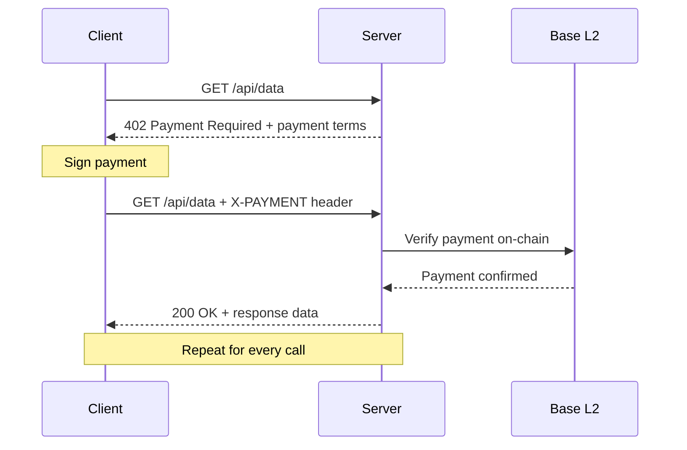
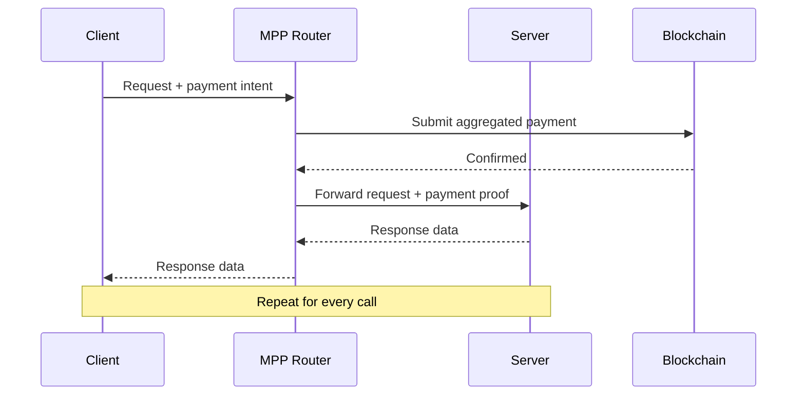
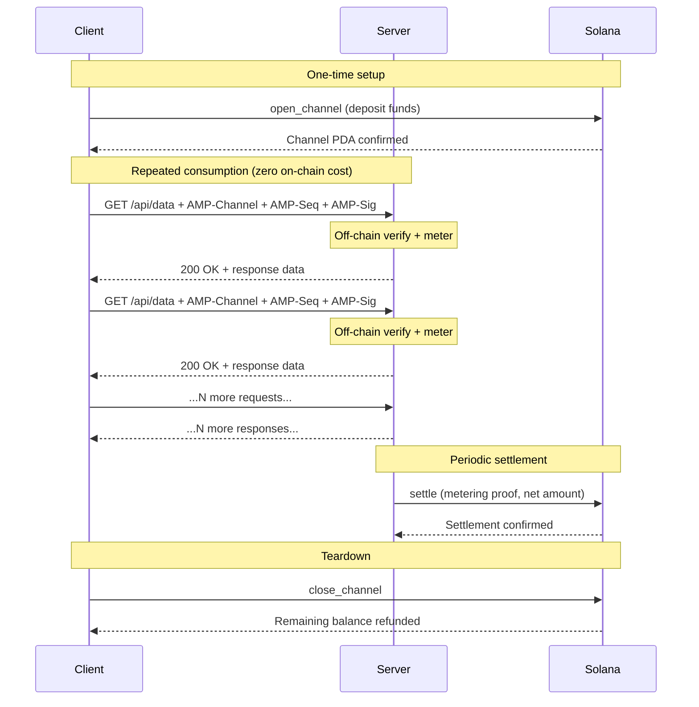

# Protocol Comparison: x402 vs MPP vs AMP

## 1. Architecture Overview

**x402** is a per-request payment protocol built on the HTTP 402 status code. When a client requests a paid endpoint, the server responds with 402 and a payment requirement. The client signs a payment (on Base L2), attaches it to a retry request, and the server verifies the payment on-chain before serving the response. Every API call produces one on-chain transaction.

**MPP** (Micropayment Protocol) is a payment routing protocol that adds a coordination layer between clients and services. Payments are routed through intermediary nodes that aggregate and forward payments across multiple chains. Each request still requires a payment, but the routing layer batches some operations, reducing — but not eliminating — per-call on-chain cost.

**AMP** (Autonomous Machine Payments) is a Solana-native financial state channel protocol. The client opens a channel once with a deposit, then consumes services freely against that deposit. The server meters usage off-chain and settles periodically via net clearing. For 1,000 API calls, AMP produces approximately 3 on-chain transactions (open, settle, close) regardless of call volume.

---

## 2. Flow Comparison

### x402 — Per-Request Payment

### MPP — Routed Payment

### AMP — Channel-Based

---

## 3. Feature Matrix

| Feature | x402 | MPP | AMP |
|---------|------|-----|-----|
| Payment Model | Per-request | Per-request | Continuous channel |
| Core Primitive | HTTP 402 code | Payment routing | Financial state channel |
| Runtime Latency | Every call | Every call | Zero after open |
| Statefulness | Stateless | Stateless | Persistent state |
| Transport | HTTP only | HTTP only | Any (HTTP/WS/gRPC/MQTT/TCP) |
| Chain | Base (EVM) | Multi-chain | Solana native |
| Settlement | Immediate per-call | Routed | Net cleared on interval |
| On-chain Txns / 1K calls | 1,000 | ~100-500 | 1-3 |
| Finality | ~2s (Base) | Varies | 400ms (Solana) |
| Credit Support | None | None | Native (ACE) |
| Reputation / Trust | None | None | Built-in scoring |
| Streaming Data | Not supported | Not supported | Native |
| Channel Delegation | Not possible | Not possible | Supported |
| Budget Management | Manual per-call | Manual | Deposit once, auto |
| Integration Effort | Middleware / route | SDK + config | One-line middleware |
| Agent UX | Sign every call | Sign every call | Open once, use freely |
| Multi-party Splits | Manual | Built-in routing | Channel composition |
| DeFi Composability | Limited | Limited | Full Solana |

---

## 4. Cost Analysis

### Scenario: 1,000 API Calls at $0.001 per Call

Total payment amount: $1.00 USDC.

| Protocol | Chain | On-chain Transactions | Avg Txn Cost | Total Gas Cost | Gas as % of Payment |
|----------|-------|-----------------------|--------------|----------------|---------------------|
| x402 | Base (EVM) | 1,000 | ~$0.001 | ~$1.00 | 100% |
| MPP | Varies | ~100-500 | ~$0.001-0.01 | ~$0.10-5.00 | 10-500% |
| AMP | Solana | 3 | ~$0.00025 | ~$0.00075 | 0.075% |

**AMP vs x402:** AMP is approximately **1,333x cheaper** in transaction costs.

At 1,000 calls, x402's gas costs equal the entire payment amount. AMP's gas costs are less than one-tenth of one percent of the payment amount.

### Scaling: 10,000 Calls

| Protocol | On-chain Transactions | Total Gas Cost |
|----------|-----------------------|----------------|
| x402 | 10,000 | ~$10.00 |
| AMP | 3-5 | ~$0.00075-0.00125 |

AMP's on-chain cost is constant regardless of call volume (bounded by the number of settlement cycles, not the number of calls).

---

## 5. Latency Analysis

### Per-Call Overhead

**x402:** Each call requires 3 round-trips:
1. Client sends request → Server responds 402.
2. Client signs payment → Client retries with payment header.
3. Server verifies on-chain → Server responds with data.

Additional latency per call: ~2-4 seconds (includes on-chain verification on Base).

**MPP:** Each call requires 2-3 round-trips through the routing layer, plus on-chain verification for batched payments. Additional latency per call: ~1-3 seconds.

**AMP:** After channel open, each call requires 1 round-trip:
1. Client sends request with `AMP-Channel`, `AMP-Seq`, `AMP-Sig` → Server verifies off-chain → Server responds with data.

Additional latency per call: **~0ms** (off-chain signature verification is sub-millisecond).

### Aggregate Latency for 1,000 Calls

| Protocol | Per-call Overhead | Total Added Latency |
|----------|-------------------|---------------------|
| x402 | ~2-4s | ~2,000-4,000s (33-66 min) |
| MPP | ~1-3s | ~1,000-3,000s (16-50 min) |
| AMP | ~0ms | ~0s (after 1-2s channel open) |

AMP adds effectively zero latency to the application's request path after the one-time channel open.
