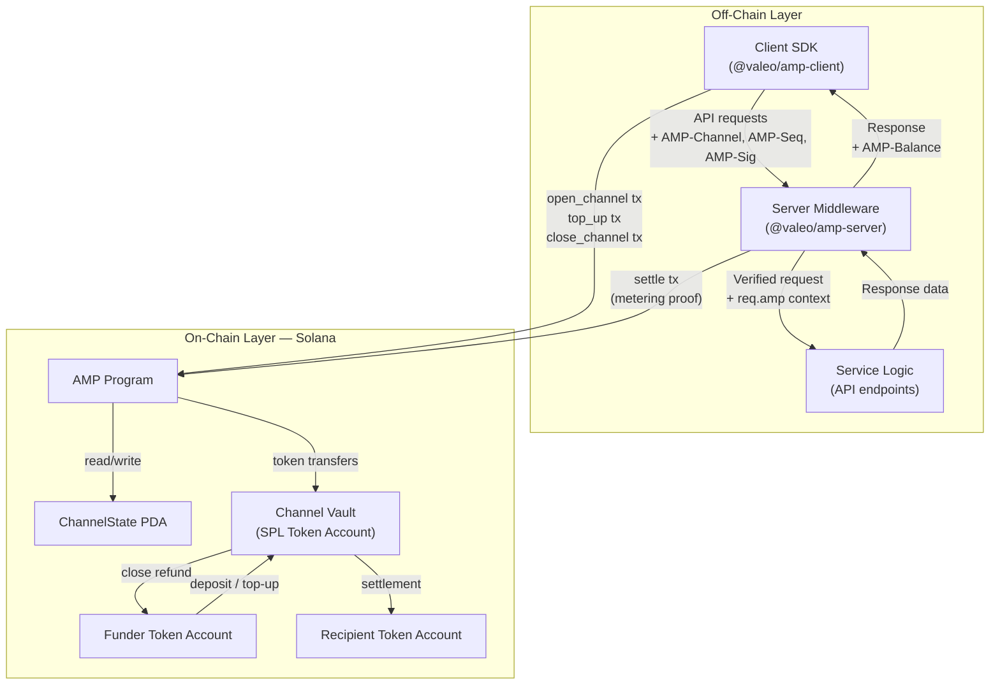
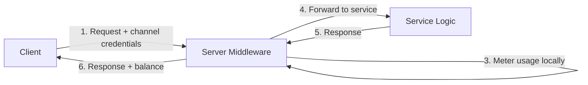
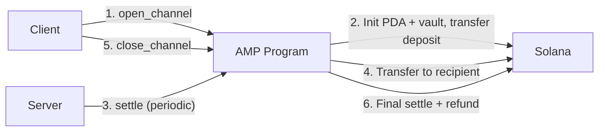

# AMP Architecture

System architecture showing the relationship between the client SDK, server middleware, Solana program, and token vault. Off-chain data flows are separated from on-chain flows.

## Data Flow Summary

### Off-Chain Flows (per request, zero on-chain cost)

### On-Chain Flows (infrequent, ~3 total per channel lifetime)

## Component Responsibilities

| Component | Responsibilities |
|-----------|-----------------|
| **Client SDK** | Discovery, channel open/close/top-up, sequence management, signature generation, `fetch()` wrapper |
| **Server Middleware** | Pricing endpoint, 402 responses, channel validation, signature verification, metering, settlement submission |
| **AMP Program** | Channel state management, token custody, settlement verification (Ed25519 precompile), fund transfers |
| **Channel Vault** | SPL token account owned by PDA, holds deposited funds, source for settlements and refunds |
