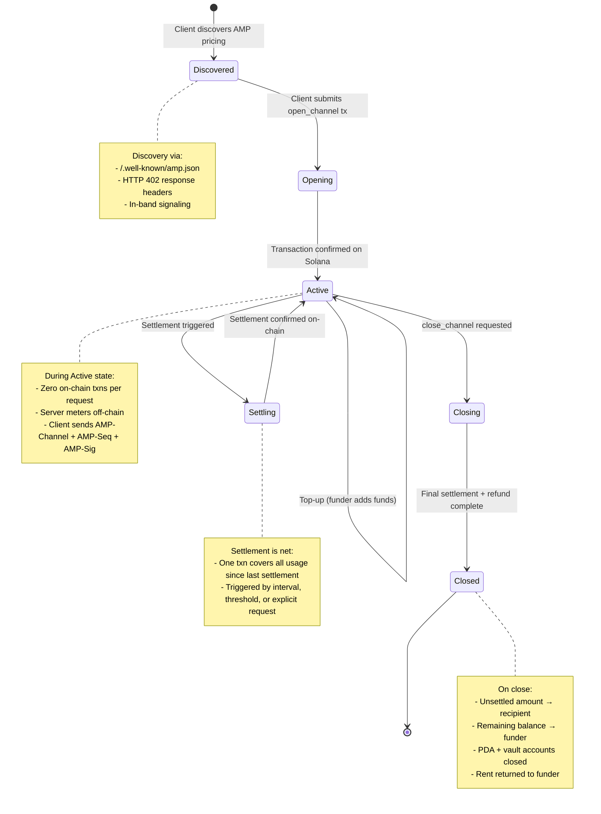

# Channel Lifecycle

State diagram showing the lifecycle of an AMP channel from discovery through closure.

## State Transitions

| From | To | Trigger | On-chain |
|------|----|---------|----------|
| — | Discovered | Client queries pricing | No |
| Discovered | Opening | Client submits `open_channel` | Yes |
| Opening | Active | Transaction finalized | Yes |
| Active | Active | `top_up` instruction | Yes |
| Active | Settling | Interval elapsed / threshold reached / explicit request | Yes |
| Settling | Active | Settlement tx confirmed | Yes |
| Active | Closing | `close_channel` instruction | Yes |
| Closing | Closed | Final settlement + refund confirmed | Yes |
