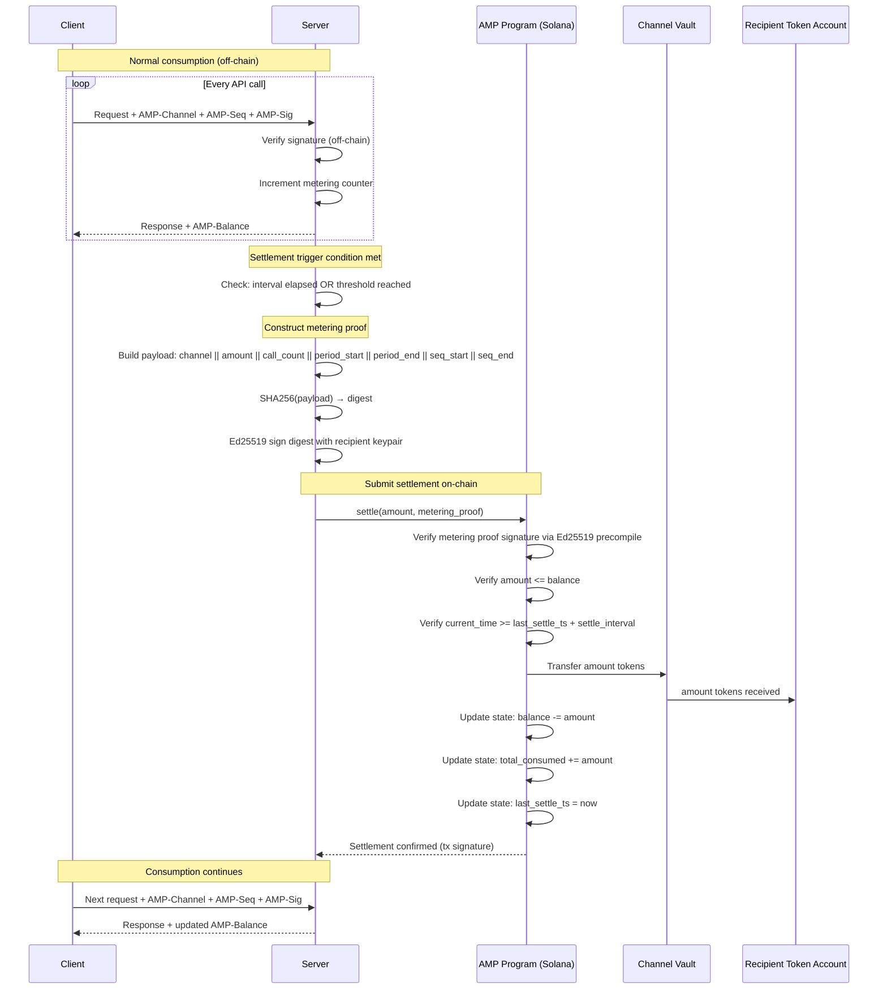

# Settlement Flow

Sequence diagram showing the full settlement process between a client, server, and the Solana AMP program.

## Settlement Triggers

| Trigger | Condition | Example |
|---------|-----------|---------|
| Time interval | `current_time >= last_settle_ts + settle_interval` | Every 3600 seconds |
| Usage threshold | `accumulated_amount >= threshold` | Every 1,000,000 token units |
| Explicit request | Either party sends settlement request | Client or server initiates |
| Channel close | `close_channel` instruction submitted | Final settlement before refund |

## On-Chain State Changes

After a successful settlement:

| Field | Change |
|-------|--------|
| `balance` | Decreased by `amount` |
| `total_consumed` | Increased by `amount` |
| `last_settle_ts` | Set to current block timestamp |
